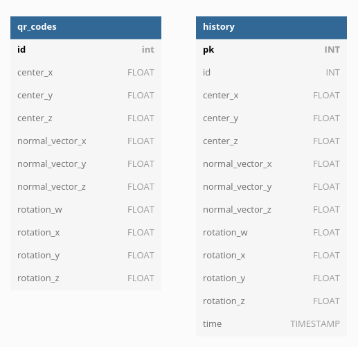

# Architecture #

Collection of different diagrams

### Architecture diagram ###

### Database schema ###

### Nodes ###

More information about the nodes can be found in their respective READMEs
- [Camera node](../workspace/src/ros2mapper_camera_node/)
- [Explore node](../workspace/src/ros2mapper_explore_node/)
- [Interfaces](../workspace/src/interfaces/)
- [IO node](../workspace/src/ros2mapper_io_node/)
- [Memory node](../workspace/src/ros2mapper_memory_node/)
- [Nav2 simple commander](../workspace/src/nav2_simple_commander/)
- [QR Code reader](../workspace/src/ros2mapper_qr_code_reader/)
