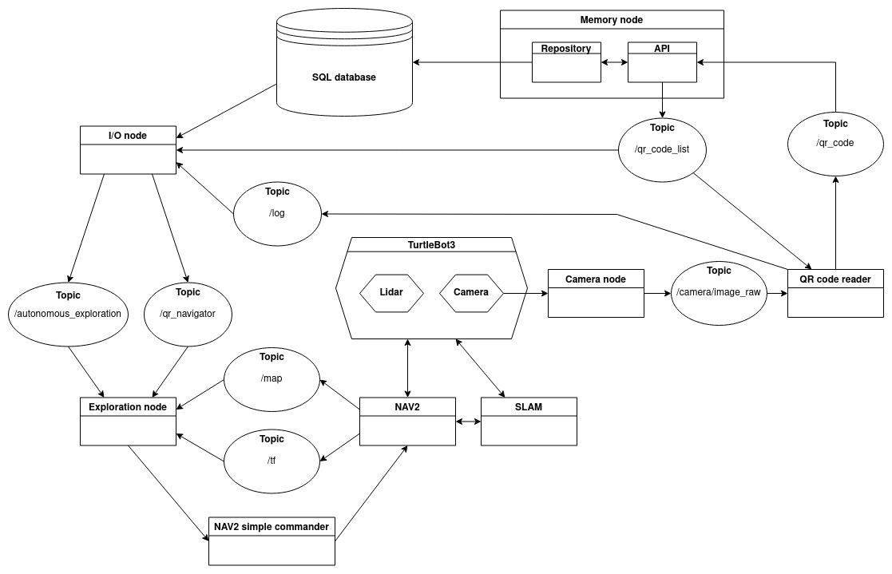

# Architecture #

Collection of different diagrams

### Architecture diagram ###



### Camera node ###

```
,------------------------------------------------------------.
|workspace.src.camera_node.camera_node.camera_node.CameraNode|
|------------------------------------------------------------|
|timer:                                                      |
|cap:                                                        |
|publisher:                                                  |
|bridge:                                                     |
|__init__(self):                                             |
|publish_image(self):                                        |
`------------------------------------------------------------'
                               |                              
                               |                              
                            ,----.                            
                            |Node|                            
                            |----|                            
                            `----'                            
```

### I/O node ###

```
,--------------------------------------------.                                                                                                                                                                                       
|workspace.src.io_node.io_node.io_node.IONode|                                                                                                                                                                                       
|--------------------------------------------|                                                                                                                                                                                       
|timer:                                      |                                                                                                                                                                                       
|view:                                       |                                                                                                                                                                                       
|main_menu:                                  |                                                                                                                                                                                       
|qr_menu_publisher:                          |                                                                                                                                                                                       
|log_subscription_:                          |                                                                                                                                                                                       
|exploration_publisher:                      |                                                                                                                                                                                       
|qr_menu:                                    |                                                                                                                                                                                       
|manual_control:                             |                                                                                                                                                                                       
|qr_code_subscription_:                      |                                                                                                                                                                                       
|__init__(self):                             |                                                                                                                                                                                       
|load_view(self, view):                      |                                                                                                                                                                                       
|check_quit(self):                           |                                                                                                                                                                                       
|log(self, msg: String):                     |                                                                                                                                                                                       
`--------------------------------------------'                                                                                                                                                                                       
                                                                                                                                                                                                                                     
                                                                                                                                                                                                                                     
                               ,-----------------------------------------------------------.                                                                                                                                         
                               |workspace.src.io_node.io_node.submodules.main_menu.MainMenu|                                                                            ,-----------------------------------------------------------.
                               |-----------------------------------------------------------|                                                                            |workspace.src.io_node.io_node.submodules.qr_menu.QRMenu    |
                               |running:                                                   |                                                                            |-----------------------------------------------------------|
                               |_data_to_log:                                              |   ,---------------------------------------------------------------------.  |running:                                                   |
                               |_load_manual_control_view:                                 |   |workspace.src.io_node.io_node.submodules.manual_control.ManualControl|  |_data_to_log:                                              |
                               |_publisher:                                                |   |---------------------------------------------------------------------|  |_stop_exploring:                                           |
                               |thread:                                                    |   |running:                                                             |  |_qr_codes:                                                 |
                               |_load_qr_view:                                             |   |_return_to_menu:                                                     |  |_reprint_menu:                                             |
                               |__init__(self, publisher: Callable[[String], None]):       |   |__init__(self, return_to_menu):                                      |  |_publisher:                                                |
                ,----.         |set_load_functions(                                        |   |open(self):                                                          |  |thread:                                                    |
                |Node|         |     self,                                                 |   |close(self):                                                         |  |_return_to_menu:                                           |
                |----|         |     load_manual_control_view: Callable[[], None],         |   |_get_key(self, settings):                                            |  |__init__(self, return_to_menu, stop_exploring, publisher): |
                `----'         |     load_qr_view: Callable[[], None],                     |   |_print_vels(self, target_linear_velocity, target_angular_velocity):  |  |open(self):                                                |
                               | ):                                                        |   |_make_simple_profile(self, output, input, slop):                     |  |close(self):                                               |
                               |open(self):                                                |   |_constrain(self, input_vel, low_bound, high_bound):                  |  |log(self, data: str):                                      |
                               |close(self):                                               |   |_check_linear_limit_velocity(self, velocity):                        |  |qr_listener_callback(self, qr_code: QRCode):               |
                               |log(self, data: str):                                      |   |_check_angular_limit_velocity(self, velocity):                       |  |_qr_navigation_callback(self, qr_code: QRCode):            |
                               |_exploration_callback(self, msg_command: String):          |   |_main(self):                                                         |  |_get_key(self, settings):                                  |
                               |_get_key(self, settings):                                  |   `---------------------------------------------------------------------'  |_print_menu(self):                                         |
                               |_print_menu(self):                                         |                                                                            |_handle_io(self):                                          |
                               |_handle_io(self):                                          |                                                                            |_main(self):                                               |
                               |_main(self):                                               |                                                                            `-----------------------------------------------------------'
                               `-----------------------------------------------------------'                                                                                                                                         
                                                             |                                                                                                                                                                       
                                     ,----------------------------------------------.                                                                                                                                                
                                     |object                                        |                                                                                                                                                
                                     |----------------------------------------------|                                                                                                                                                
                                     |__doc__:                                      |                                                                                                                                                
                                     |__dict__:                                     |                                                                                                                                                
                                     |__slots__:                                    |                                                                                                                                                
                                     |__module__:                                   |                                                                                                                                                
                                     |__annotations__:                              |                                                                                                                                                
                                     |__class__(self: _T):                          |                                                                                                                                                
                                     |__class__(self, __type: Type[object]):        |                                                                                                                                                
                                     |__init__(self):                               |                                                                                                                                                
                                     |__new__(cls: Type[_T]):                       |                                                                                                                                                
                                     |__setattr__(self, name: str, value: Any):     |                                                                                                                                                
                                     |__eq__(self, o: object):                      |                                                                                                                                                
                                     |__ne__(self, o: object):                      |                                                                                                                                                
                                     |__str__(self):                                |                                                                                                                                                
                                     |__repr__(self):                               |                                                                                                                                                
                                     |__hash__(self):                               |                                                                                                                                                
                                     |__format__(self, format_spec: str):           |                                                                                                                                                
                                     |__getattribute__(self, name: str):            |                                                                                                                                                
                                     |__delattr__(self, name: str):                 |                                                                                                                                                
                                     |__sizeof__(self):                             |                                                                                                                                                
                                     |__reduce__(self):                             |                                                                                                                                                
                                     |__reduce_ex__(self, protocol: SupportsIndex): |                                                                                                                                                
                                     |__reduce_ex__(self, protocol: int):           |                                                                                                                                                
                                     |__dir__(self):                                |                                                                                                                                                
                                     |__init_subclass__(cls):                       |                                                                                                                                                
                                     `----------------------------------------------'                                                                                                                                                
                                                             |                                                                                                                                                                       
                                                                                                                                                                                                                                     
                                                    ,----------------.                                                                                                                                                               
                                                    |typing.Hashable |                                                                                                                                                               
                                                    |----------------|                                                                                                                                                               
                                                    |__hash__(self): |                                                                                                                                                               
                                                    `----------------'                                                                                                                                                               
```